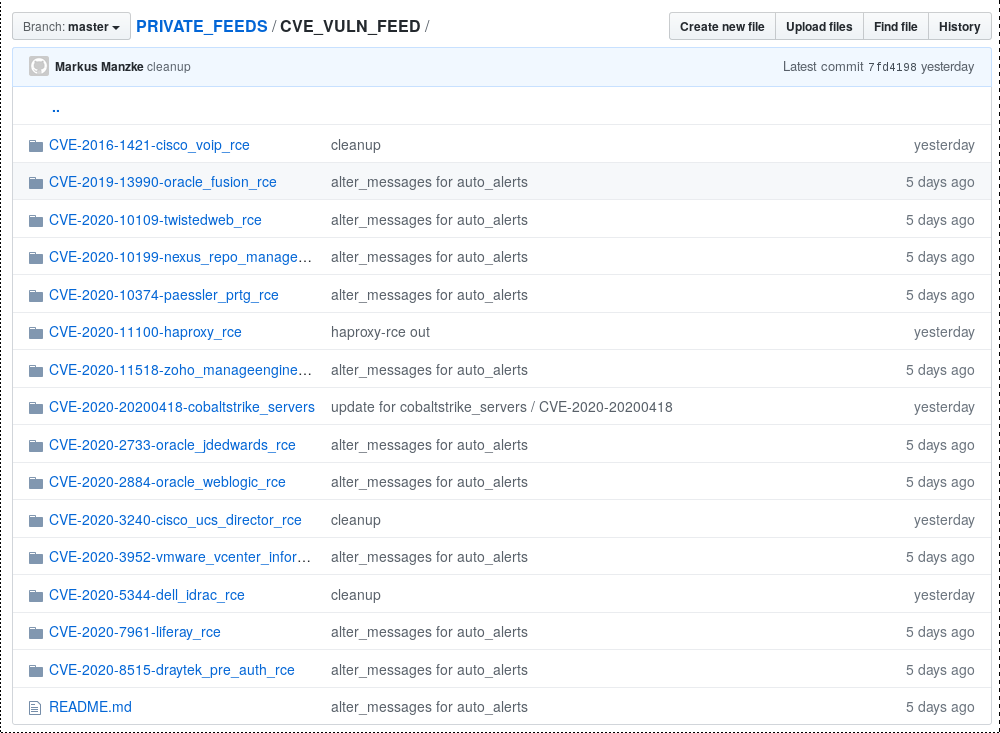
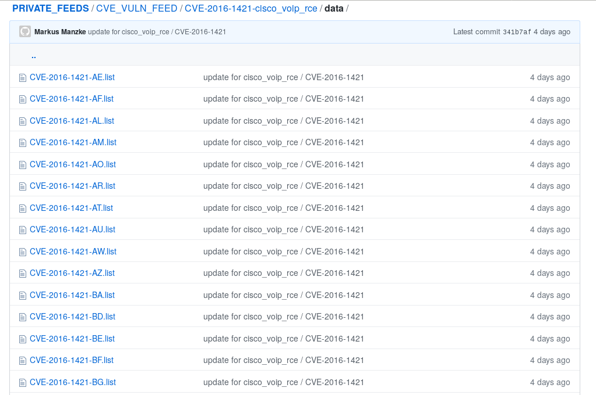

## Readme for COVID_CTI-League CVE_VULN_FEED

this is a short readme for the [COVID-CTI-League CVE_VULN_FEED](https://github.com/COVID-19-CTI-LEAGUE/PRIVATE_FEEDS/tree/master/CVE_VULN_FEED)
to be accessed from the outside.

Reference: [Welcome to the CTI League](https://cti-league.com/)

## what it is

CVE_VULN_FEED is a Repo of critical vulns regarding internet-infrastructure,
servers and services. there is one folder for each Vuln, and within this folder a 
data-dir, that keeps a list of IPs/AS-nr/AS-Description, seperated by country.

additionally, you might want to register for automated notification,
based on AS-attribution (SOC) or Country-attribution (CERT)

## what it does

whenever a critical vulnerability is published that matches the following
criteria:

- [CVSS-Score](https://nvd.nist.gov/vuln-metrics/cvss) >= 9

- userInteraction == None
- privilegesRequired == None
- ( confidentialityImpact == HIGH  OR availabilityImpact == HIGH OR integrityImpact == HIGH)
- attackVector == NETWORK 
- attackComplexity == (LOW OR MEDIUM)

which translates usually to [RCE](https://searchwindowsserver.techtarget.com/definition/remote-code-execution-RCE)
or unauthorized Data-Access, or a 0-day or exploit_campaign going on, 
we use <strike>super sophisticated cyber</strike> OSINT-methods to identify
servers and/or services that might fall into the category of beeing affected by the vuln/exploit.

we then extract the belonging IPs, check which country/as they are attributed, an generate country_based lists
for easier access.

our baseline: that moment a CVE comes out or a 0day,
all affected devices are to be considered possibly
vulnerable. if we take a pure device/service-scan
from the day bevore (pure OSINT) we have a
list of targets

these method worked very well with recent vulns of
technologgies like WebLogic/Liferay - Applicationservers,
PulseVPN/Citrix/Netscaler-VPN-Gateways, and Exchange/OWA-Vulns.
YMMV, but better safe than sorry, especially by internet-facing
applications and appliances.

there are as well short helping-docs in each CVE-dir:

- Readme.md: a very brief description on what you might find (auto_generated)
- summary.md: a statistical breakdown by AS and Country (auto_generated)
- alert_text.md: a short notice about the vuln an links for further reference/analysis, also included in notifications 

## what it does NOT do

**we do not, under any circumstances, make a vulnscan**

the assumption is: when a vuln/0day comes out, and we take data from that day or before, and we can
say with a high confidentiality, that an exploit is not super-artificial, we assume
that all found system from that day ore bevore are **potentially**
vulnerable.

## who might be interested

- National-Certs -> receive alerts from IPs in your Country
- PSIRT/SOC -> > receive alerts from Vulns and IPs in your AS
- Telcos/DC-Provider -> receive alerts from Vulns and IPs in your AS

## notifications 

- tbd

## disclaimer

- since we do not make a full vuln_scan, the datasets can include False-Positive and exlcude False-Negatives
- GeoIP-Attribution might be wrong sometimes

